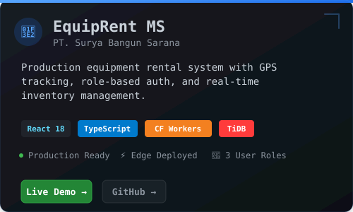
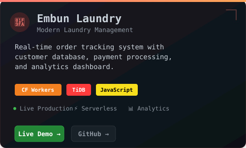
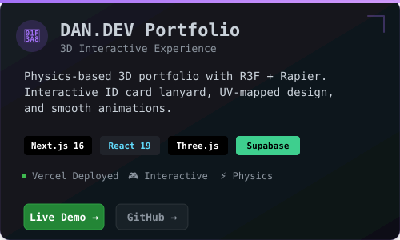
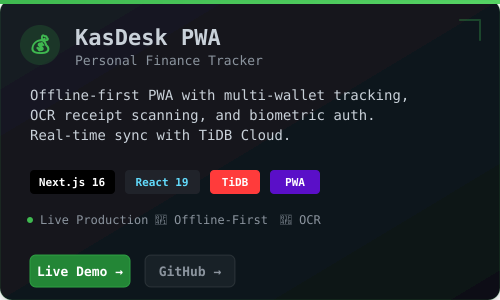

<div align="center">



[](https://portofoliodan-lovat.vercel.app)
[](mailto:dhanisepeda@gmail.com)
[](https://wa.me/6282148564979)

</div>

---

## 👨‍💻 About Me

```typescript
interface Developer {
  name: string;
  role: string;
  location: string;
  education: string;
  philosophy: string;
}

const dhani: Developer = {
  name: "Muhammad Rizki Ramadhani",
  role: "Full-stack Software Engineer",
  location: "Banjarmasin, Indonesia 🇮🇩",
  education: "Computer Science • Semester 7 • UNISKA",
  philosophy: "Clean code, real impact, production-ready"
};

// Current focus
const building = [
  "Scalable edge applications on Cloudflare Workers",
  "3D interactive web experiences with Three.js + R3F",
  "Serverless architectures with TiDB Cloud",
  "Offline-first Progressive Web Apps"
];

// Seeking
const lookingFor = "Internship in Software Engineering / System Engineering";
```

<details>
<summary>⚡ More Details</summary>

- 🔭 **Current Project**: Embun Laundry Management System (Cloudflare Workers + TiDB)
- 🌱 **Learning**: Advanced WebGL shaders, Rapier physics, edge computing patterns
- 💼 **Experience**: 4+ production apps deployed (EquipRent MS, KasDesk, Portfolio, Embun Laundry)
- 🎯 **Target Roles**: Software Engineer, Full-stack Developer, System Engineer, Cloud Engineer
- 🎨 **Design Philosophy**: "God Mode" - zero AI slop, technical depth over hype
- ⚡ **Fun Fact**: Building autonomous AI agent loops for development automation

</details>

---

## 🛠️ Tech Stack & Expertise


<div align="center">

### Core Technologies

**Frontend Engineering**  
Next.js 16 (App Router, RSC) • React 19 (Server Actions, Transitions) • TypeScript (Strict Mode)  
Three.js / React Three Fiber • Rapier Physics • Tailwind CSS v4 • Framer Motion

**Backend & Cloud**  
Cloudflare Workers • Node.js • Edge Runtime • Serverless Functions  
RESTful API Design • WebSocket Real-time • Webhook Integration

**Database & Storage**  
TiDB Cloud Serverless • Supabase (PostgreSQL + RLS) • Drizzle ORM  
SQL Schema Design • Database Indexing • Query Optimization

**DevOps & Tools**  
Git & GitHub • Docker • Linux Administration • Vercel Deployment  
CI/CD Pipelines • Progressive Web Apps • Service Workers

**Additional Skills**  
PHP • FastAPI • Python • MySQL • OpenCV • AI Integration (Gemini API)

</div>

---

## 🚀 Featured Projects

<div align="center">

### Production-Grade Applications

<table>
<tr>
<td width="50%">

[](https://equiprent-pt-surya-bangun-sarana.dhanisepeda.workers.dev)

**[Live Demo →](https://equiprent-pt-surya-bangun-sarana.dhanisepeda.workers.dev)** • **[GitHub →](https://github.com/Dhani078/equiprent-pt-surya-bangun-sarana)**

Heavy equipment rental system for PT. Surya Bangun Sarana with GPS tracking, role-based authentication (Admin/Staff/User), real-time inventory management, and transaction processing. Deployed on Cloudflare edge network for global performance.

**Tech**: React 18 • TypeScript • Cloudflare Workers • TiDB

</td>
<td width="50%">

[](https://embun-laundry.dhanisepeda.workers.dev)

**[Live Demo →](https://embun-laundry.dhanisepeda.workers.dev)** • **[GitHub →](https://github.com/Dhani078/dhani-laundry)**

Modern laundry management system with real-time order tracking, customer database, payment processing, and analytics dashboard. Serverless architecture for zero-maintenance scaling.

**Tech**: Cloudflare Workers • TiDB • JavaScript • REST API

</td>
</tr>
<tr>
<td width="50%">

[](https://portofoliodan-lovat.vercel.app)

**[Live Demo →](https://portofoliodan-lovat.vercel.app)** • **[GitHub →](https://github.com/Dhani078/Portofolio)**

3D interactive portfolio featuring physics-based ID card lanyard with R3F + Rapier. UV-mapped front/back card design, smooth animations, and dark-themed "God Mode" aesthetic. Responsive 3D experience on all devices.

**Tech**: Next.js 16 • React 19 • Three.js • Rapier • Supabase

</td>
<td width="50%">

[](https://kas-desk.vercel.app)

**[Live Demo →](https://kas-desk.vercel.app)** • **[GitHub →](https://github.com/Dhani078/KasDesk)**

Personal finance & wealth tracker with offline-first PWA architecture, multi-wallet transaction tracking, OCR receipt scanning (Gemini Vision API), biometric authentication, and real-time sync with TiDB Cloud.

**Tech**: Next.js 16 • React 19 • TiDB • Drizzle ORM • PWA

</td>
</tr>
</table>

**[→ View All Repositories](https://github.com/Dhani078?tab=repositories)**

</div>

---

## 📊 GitHub Activity

<div align="center">


</div>

---

## 🏆 GitHub Trophies

<div align="center">


</div>

---

## 💼 Open to Internship Opportunities

<div align="center">

```typescript
interface InternshipPreferences {
  roles: string[];
  interests: string[];
  location: string;
  workType: string[];
  availability: string;
  focus: string;
}

const seekingInternship: InternshipPreferences = {
  roles: [
    "Software Engineer",
    "Full-stack Developer",
    "System Engineer",
    "Cloud/Edge Engineer"
  ],
  
  interests: [
    "Web Development (Next.js, React, TypeScript)",
    "Serverless & Edge Computing (Cloudflare Workers)",
    "3D Web Experiences (Three.js, React Three Fiber)",
    "Cloud Infrastructure & DevOps",
    "System Design & Database Architecture"
  ],
  
  location: "Banjarmasin, Indonesia",
  workType: ["On-site", "Hybrid", "Remote"],
  availability: "Immediately available",
  focus: "Real coding projects with portfolio output, not admin/content work"
};
```

### 🎯 Target Companies

- **OJT Informatika** - Linux, Docker, Open Journal Systems
- **BanjarKode** - Software Development
- **iTech Space** - Tech Innovation
- **Cipta Dewantara** - Enterprise Systems
- **Government Agencies** - Bappeda Litbang, Disbudporapar, DPMPTSP, Disdukcapil

</div>

---

## 📬 Connect With Me

<div align="center">

<table>
<tr>
<td align="center" width="25%">
<a href="https://portofoliodan-lovat.vercel.app">

<br><br>
<b>Portfolio</b>
<br>
<sub>DAN.DEV</sub>
</a>
</td>
<td align="center" width="25%">
<a href="mailto:dhanisepeda@gmail.com">

<br><br>
<b>Email</b>
<br>
<sub>dhanisepeda@gmail.com</sub>
</a>
</td>
<td align="center" width="25%">
<a href="https://wa.me/6282148564979">

<br><br>
<b>WhatsApp</b>
<br>
<sub>+62 821-4856-4979</sub>
</a>
</td>
<td align="center" width="25%">
<a href="https://github.com/Dhani078">

<br><br>
<b>GitHub</b>
<br>
<sub>@Dhani078</sub>
</a>
</td>
</tr>
</table>

---


### 💡 "Clean code, real impact, production-ready"

**Available for internship opportunities • Let's build something great together**

</div>
